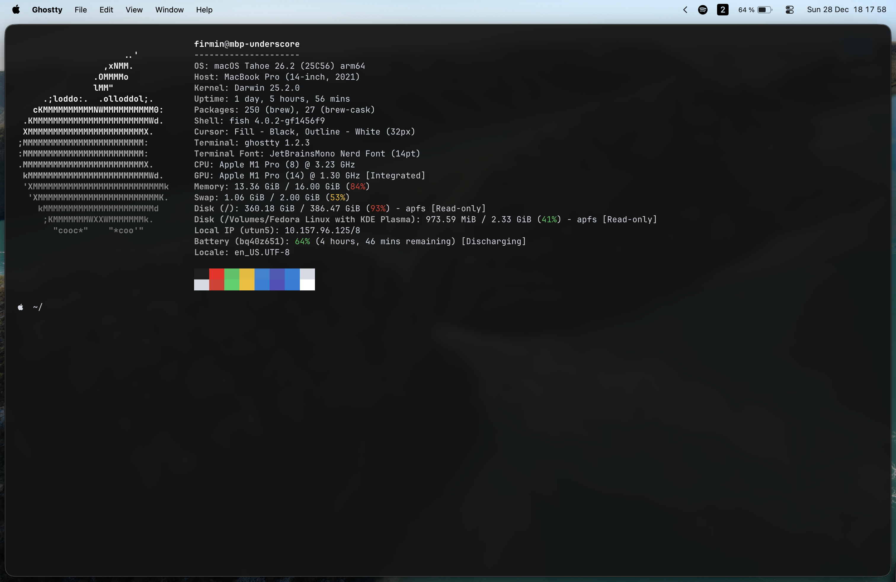

# FirminUnderscore's macOS dotfiles (and install script)



Now that I've been using a Mac for a while, here's how it should be set up.

The install script is meant to be a quick start in case I need to reinstall a new Mac someday, but it's not a complete setup.

## How to use ?

```bash
Usage: ./install.sh [OPTIONS]
Options:
  --all        Run full setup (default if no args)
  --dotfiles   Link dotfiles only (stow)
  --packages   Install Homebrew & packages only
  --macos      Apply macOS preferences only
  --help       Show this help message
```

## Contributors

- [@Zarox28](https://github.com/Zarox28) (The initial fish config has been stollen from him but he's fine with that)
